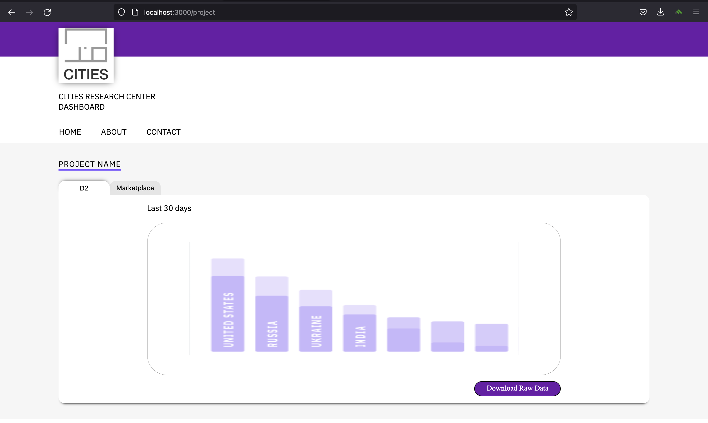
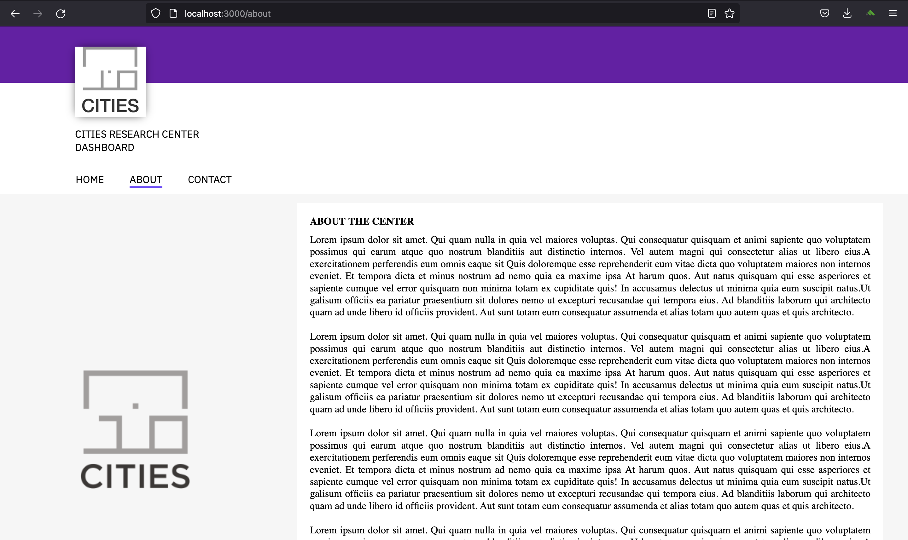
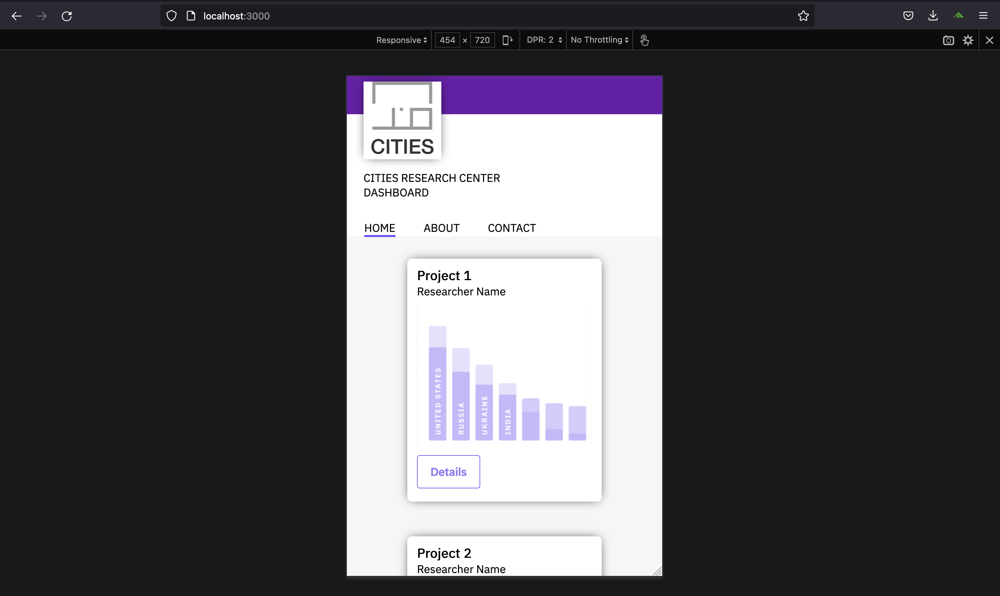
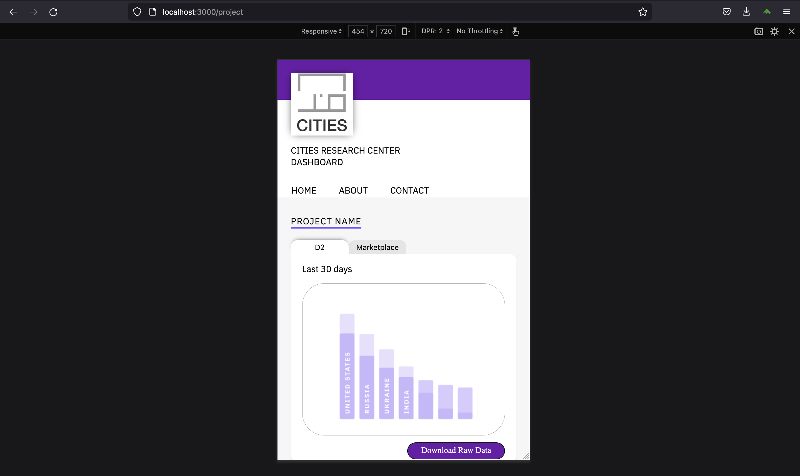
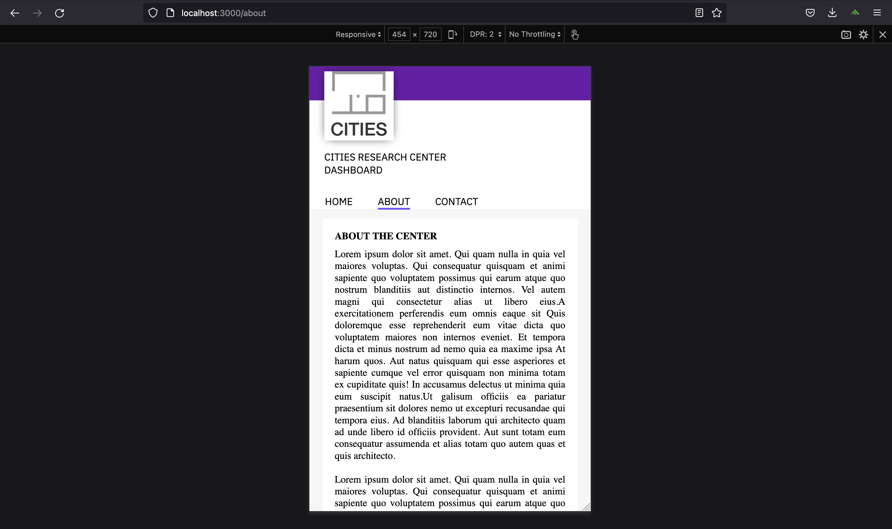
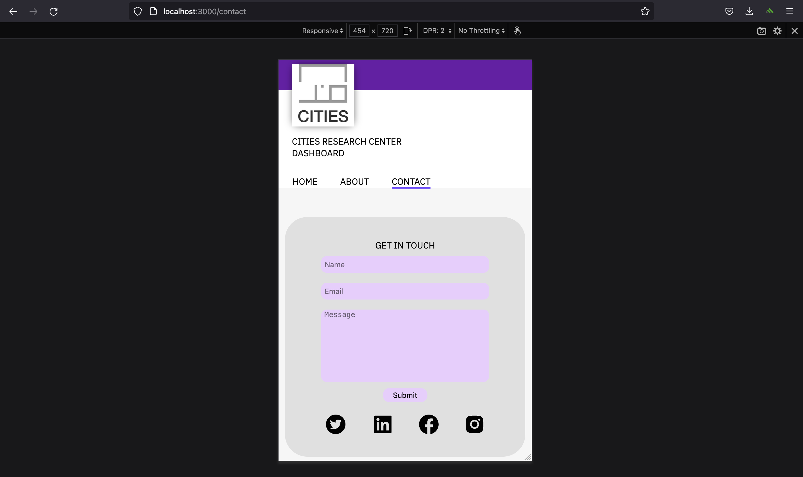

# CITIES VISUALISATION DASHBOARD

- [CITIES Visualisation Dashnoard](#cities-visualisation-dashboard)
  - [Description](#description)
    - [React Components](#react-components)
  - [Instructions to Build and Test Locally](#instructions-to-build-and-test-locally)
    - [Run Front-end](#run-front-end)
    - [Run Back-end](#run-back-end)
  - [Team Members](#team-members)
  - [Contributing](#contributing)
  - [References](#references)

## Description

This is an app designed to visualize data and provide meaningful context about the data being visualized.

### React Components

The front-end of this app was built with React.js.There are three react components used in creating the pages of this app.

- Header :

  The header component is at the top of the page. It consists of CITIES logo , a title and a menu bar.

## Instructions to Build and Test Locally

### Run Back-end

Coming soon...

### Run Front-end

Go to front end folder

```
cd front-end
```

Install dependencies

```
npm install
```

Run front end program

```
npm start
```

Now you should see a browser window running the app.

<!-- ## Screenshots

### Desktop view

- Home Page
    

- Project Page
    

- About Page
    

<!-- ### Mobile view

- Home Page
    

- Project Page
    

- About Page
    

- Contact Page
     -->

## Team Members

[@princeampofo](https://github.com/princeampofo)  
[@mjk9913](https://github.com/mjk9913)  
[@JenniferZheng0430](https://github.com/JenniferZheng0430)

## Contributing

Anyone is welcome to dive in! Feel free to Open an issue or Pull Request.

In terms of more detailed contributing rule, read through
[CONTRIBUTING.md](./CONTRIBUTING.md).

## References

- [React.js](https://reactjs.org/)
- [CircleCI](https://circleci.com/)
- [React Icons](https://react-icons.github.io/react-icons/)
